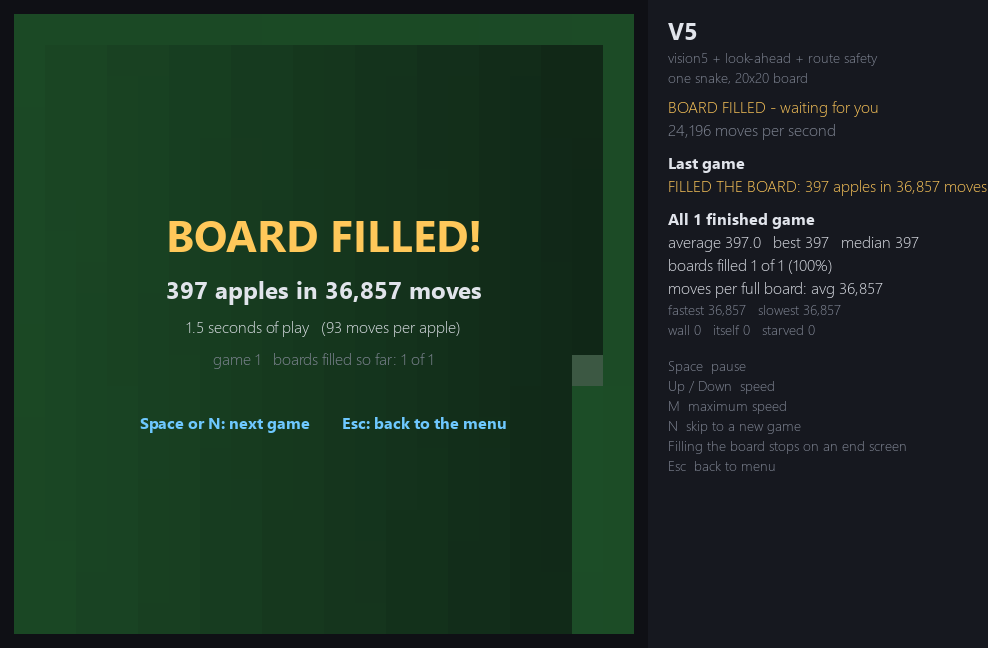

# SnakeAI

Hundreds of snakes learning to play Snake with reinforcement learning (Deep Q-Learning),
all sharing one neural network, until the best model fills every square of the board.



The included model **V5** fills the whole 20x20 board (397 apples) in every game, in about
35,000 moves. The first model, with 11 simple inputs, averaged 29 apples.

## Quick start (Windows)

1. Install Python 3.12 or newer.
2. Double-click **`run.bat`**. The first run creates a virtual environment and installs
   numpy, pygame, PyTorch and numba (a few hundred MB, once).
3. Pick from the menu:

| Option | What it does |
|---|---|
| 1. Train a new model | Headless training, as fast as the CPU allows |
| 2. Continue training a model | Carries on where it stopped (same stage, same saved positions) |
| 3. Compare models | Up to 4 models side by side, playing *identical* games |
| 4. Watch one snake at full speed | One model, one snake, about 24,000 moves per second on a 6-core i5 (V5 fills the board in ~1.5 s), end screen when the board is full |
| 5. Delete models | Pick which ones |

`train_best.bat` trains a model with the best settings found (vision5 senses, look-ahead,
route safety, bigger brain, longer horizon). Command-line versions: `train.py`, `compare.py`.

## How it learns

- **Deep Q-Learning, one shared brain.** Every snake on the board is driven by the same
  network (inputs -> 128 -> 128 -> 3: turn left / straight / turn right). Every move of every
  snake goes into one replay memory, so 1000 snakes give 1000 experiences per tick. Double
  DQN, 3-step returns, a slowly-following target network.
- **Rewards:** +10 per apple, +100 for filling the board, -10 for crashing, -20 for starving,
  a small nudge towards the apple that fades as the snake gets long, and potential-based
  shaping for tidiness (not fencing space off) and for keeping the body in route order.
- **Fair games.** Every snake starts in the same place and moves one square per tick. The only
  luck is where apples appear, and apple *k* for a given seed is always in the same place, so
  in comparisons snake #N of every model plays exactly the same game.
- **Training in stages:** short games (0-50 apples), then mid (50-150), then long (150 until the
  board is full). Later stages start from real positions the model reached itself, so it gets
  plenty of practice at the late game, where snakes actually die. Each stage moves on when it
  stops improving or has been mastered.
- **Look-ahead:** before each move the snake tries all three moves on copies of the board and
  judges where each one leads (the copies never see where the real next apple will appear).

## What the snake can see

Each model is trained with one set of senses; newer ones include everything the older ones had.

| Senses | Inputs | What it adds |
|---|---|---|
| basic | 11 | Danger in the 3 squares next to the head, direction, which way the apple is |
| vision | 42 | Room left after each move, can it reach its tail, real path distance to the apple, 8 lines of sight. All *time-aware*: body squares count as free once the tail will have moved off them |
| vision2 | 51 | Can it escape after each move (including waiting inside its own loop), can it eat the apple safely |
| vision3 | 57 | Tidiness: hugging walls and its body, how much space a move fences off |
| vision4 | 66 | Distance to its own tail, is the apple fenced off, how many pieces the free board is split into |
| vision5 | 81 | A route through every square (a Hamiltonian cycle): does a move follow it, is a shortcut safe, route distance to the apple |

**Route safety** (vision5 option): whenever a move exists that keeps the body in route order,
with room to spare and without skipping past the apple, the brain may only choose among those.
That rule on its own can never crash or starve, so it always fills the board. What the brain
learns is *speed*: which safe shortcut gets to each apple fastest.

## Results

20x20 board, no random moves. Averages come from side-by-side comparisons on identical games
(Snakey's is its training average); "Best" is the best single game recorded.

| Model | Senses | Average apples | Best game | Boards filled |
|---|---|---|---|---|
| Snakey | basic | 29 | 80 | 0% |
| vision-v2 | vision | 116 | 195 | 0% |
| V3-Full | vision3 | 136 | 317 | 0% |
| v4 | vision4 + look-ahead | 144 | 347 | 0% |
| **V5** | **vision5 + look-ahead + route safety** | **397 (full)** | **397** | **100%** |

Without route safety, even the best senses left snakes fencing themselves in at around a third
of the board: a shortcut that kills the snake 300 moves later is very hard to learn from reward
alone. A scripted player reading only the vision5 senses filled 100% of boards, which is what
led to route safety.

## The compare window

- Colours show move quality against a best-move referee (red = bad, green = best); each snake
  also darkens from head to tail so you can follow its body.
- **Tab** follows one snake across every board (same apples everywhere), **R** replays the last
  10 seconds of its life on every board at once, lined up to the moment each one died.
- Results show average, best, median, boards filled and moves per full board.

## Project layout

```
run.bat, menu.py          menu
train.py, compare.py      command-line training and comparing
train_best.bat            training with the best settings
delete_models.bat         pick models to delete
snake/
  game.py                 N snake games stepped together with numpy
  senses.py               basic / vision / vision2-5 inputs (numba)
  cycle.py                the route through every square
  paths.py, oracle.py     time-aware path finding and the best-move referee
  brain.py, agent.py      the network, replay memory, Double DQN, n-step returns
  lookahead.py            trying moves out, route safety
  trainer.py              staged training
  arena.py, render.py     side-by-side comparisons, follow mode, replays
  solo.py, fast.py        one snake at full speed and its fast engine
  config.py               every setting (override any with SNAKEAI_CONFIG=NAME=value,...)
models/                   trained models (best.pt, latest.pt, log.csv, info.json)
tests/                    game rules, senses, referee, route, fast engine
```

Run the tests with `.venv\Scripts\python -m pytest`.

`PLAN.md` has the full development notes: every design decision, experiment and measurement.
