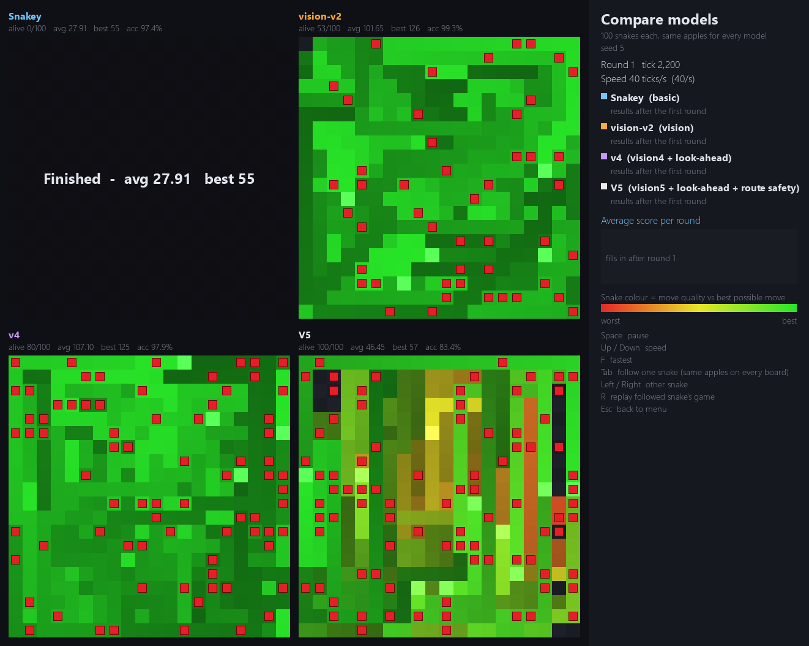
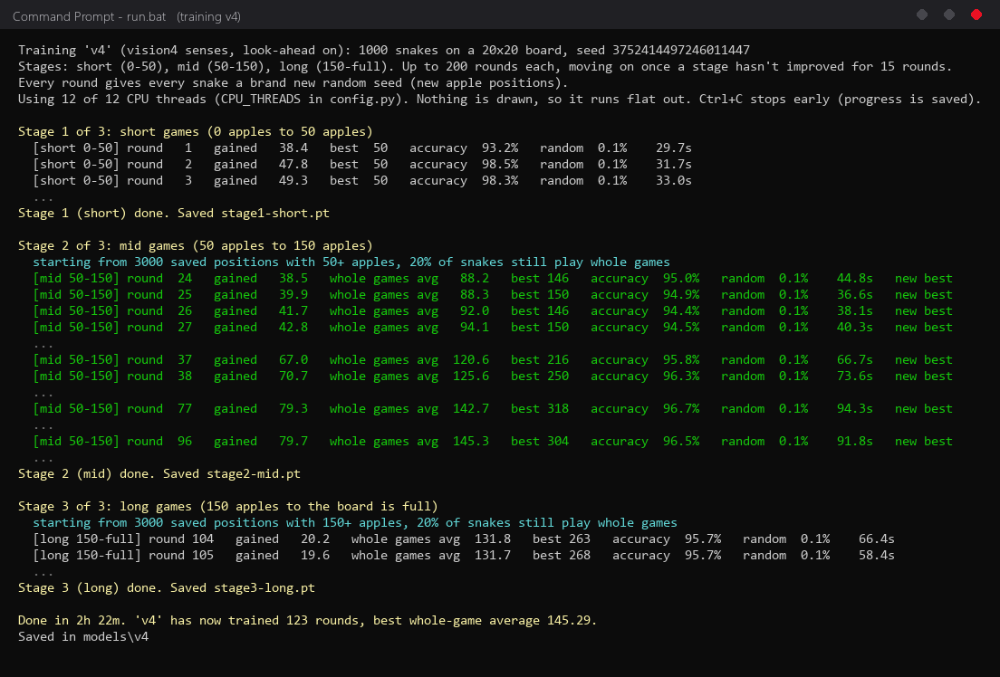
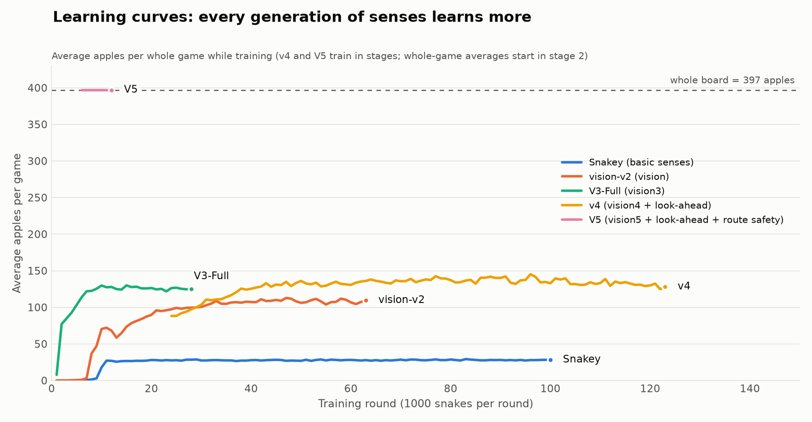
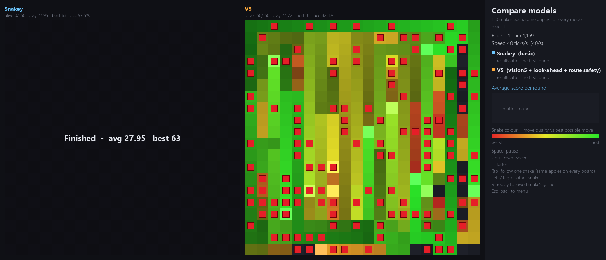

# SnakeAI

**An AI that plays Snake, controlled by a neural network that taught itself the game.**

The neural network is never shown how to play. It looks at the board, picks a move, and is
rewarded for eating apples and penalised for crashing. Through reinforcement learning (Deep
Q-Learning) it works out a strategy of its own, getting better with every game it plays.


*Four versions of the neural network playing the same 100 games. Each newer version has learned
to keep more of its snakes alive.*

## How the AI plays

Every move, the AI turns what it can see into a list of numbers: where the walls and its body
are, where the apple is, and how much room each move would leave. The neural network (two hidden
layers of 128 neurons, built in PyTorch) takes those numbers and scores the three possible moves:
turn left, go straight or turn right. The snake takes the move with the highest score.

## How it learns

- **Rewards, not examples.** +10 for an apple, −10 for crashing, −20 for going too long without
  eating. The network learns to predict which moves lead to the most reward.
- **1,000 games at once.** A thousand snakes play in parallel, all controlled by the same network,
  and every move they make becomes training data.
- **Proven techniques.** Double DQN with a target network, a replay memory of past moves, 3-step
  returns, and exploration that never picks an instantly fatal random move.
- **Training in stages.** Short games first, then longer ones, so the AI gets plenty of practice
  at the late game, where snakes usually die.



## Results

Each version of the AI was given more information about the board. Its skill grew with what it
could see, not with the size of the network.

| Version | Inputs | Average apples | Best game |
|---|---:|---:|---:|
| Snakey | 11 | 29 | 80 |
| vision-v2 | 42 | 116 | 195 |
| V3-Full | 57 | 136 | 317 |
| v4 | 66 | 144 | 347 |
| V5 | 81 | 397 | 397 |

The latest version, V5, also learned to follow a route that covers the whole board, which lets
it survive until every square is filled.



## Getting started

Requires Python 3.12 or newer. No GPU needed.

**Windows:** run `run.bat`. The first launch installs everything automatically.

**macOS / Linux:**

```bash
python3 -m venv .venv
source .venv/bin/activate
pip install -r requirements.txt
python menu.py
```

The trained networks are included, so you can watch the AI play straight away. The menu lets you:

- **Train a new model** from scratch, or **continue training** an existing one
- **Compare models**: watch up to four versions of the AI play identical games side by side
- **Watch one snake** play at full speed

From the command line: `python train.py --name my-model` to train and `python compare.py V5 v4`
to compare. Run either with `--help` for all options.



## Project structure

```
menu.py, train.py, compare.py   entry points
snake/
  brain.py      the neural network
  agent.py      Deep Q-Learning: replay memory and training step
  trainer.py    training loop and stages
  senses.py     what the AI can see
  game.py       the Snake game (1,000 games in parallel)
  lookahead.py  trying moves out before choosing
  render.py     the comparison viewer
  config.py     all settings
models/         trained networks and their training logs
tests/          unit tests (python -m pytest)
```
